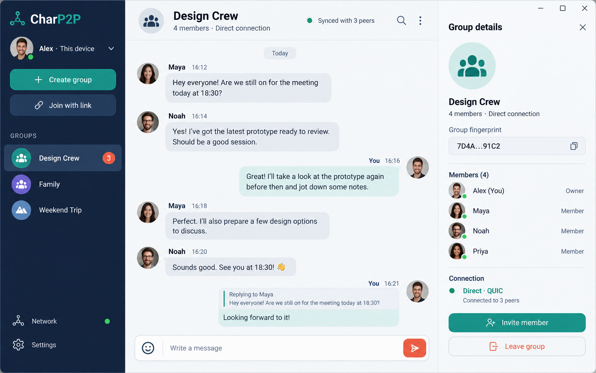
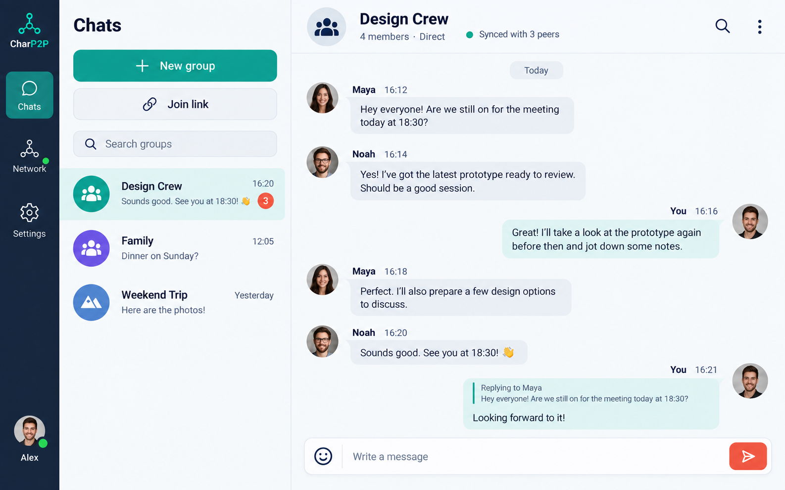

# CharP2P interface mockups

## Windows desktop

The desktop design uses three persistent panes: group navigation, the active
conversation, and group details. Network state is visible but secondary to the
conversation.

See the complete [Windows flow mockups](windows/README.md): onboarding, joining,
group creation, offline waiting, and member/device management.

## Android tablet

The tablet design uses an adaptive navigation rail, group list, and
conversation. Group details move behind the conversation header so primary
touch targets remain spacious.

See the complete [Android tablet flow mockups](tablet/README.md): onboarding,
joining, group creation, offline waiting, and member/device management.

These images establish visual direction rather than pixel-perfect
implementation specifications. Component dimensions, accessibility behavior,
window resizing, and smaller breakpoints still need deterministic wireframes.

The [generation prompts](prompts.md) are retained for reproducibility and
future visual iterations.

The [secondary-view prompt set](flow-prompts.md) records the prompts used for
the extended application flows.
