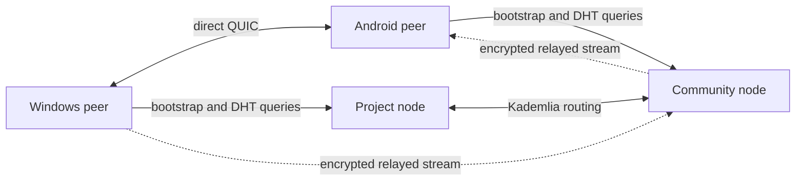

# CharP2P technical design

## Scope

This document defines protocol boundaries for the MVP. The networking and data
model live in portable Rust crates so Windows and Android implement the same
protocol. ADR-001 records the selected Tauri application shell.

## System topology



The project node has no protocol authority. It initially improves availability
because its addresses ship with the application. Community nodes implement the
same public protocol and can be added to the routing table.

## Node roles

### Light peer

Used by Android and constrained devices. It queries the DHT, advertises its own
groups while active, connects to group peers, and uses relays. It does not have
to answer routing queries for unrelated peers.

### Routing peer

Used by opted-in desktop or server installations. It maintains a Kademlia
routing table, answers DHT queries, and stores bounded, expiring provider
records.
Desktop contribution is off by default; relay capacity is a separate opt-in
with user-chosen circuit and byte limits within the routing node limits
(ADR-031).

### Relay peer

Accepts bounded circuit-relay reservations. It forwards encrypted streams and
does not terminate the group protocol or possess group keys.

The project-operated deployment runs routing, bootstrap, and relay roles. It
does not store chat events.

## Identity

Each installation creates an Ed25519 device key pair using the operating
system's secure random source. The peer identifier is derived from the public
key. Private keys are stored using platform-protected storage and can be
exported only through an explicitly encrypted backup flow.

The client stores the encoded key in Windows Credential Manager or, on
Android, an app-private preferences vault encrypted by Android Keystore. Secret
bytes remain in Rust, are zeroized after protected-storage operations, and are
never returned to the webview. ADR-007 records the adapter and record format.

An encrypted identity backup holds the display name and encoded device key,
sealed with XChaCha20-Poly1305 under a key derived from a user passphrase with
Argon2id at fixed per-version parameters. It excludes group state. ADR-028
records the format.

A group has a root public key. Its stable identifier is a versioned hash of
that key:

```text
group_id = multihash("charp2p-group-v1" || group_root_public_key)
```

The initial owner controls the corresponding administration key. Membership
and device authorization are expressed as signed group events. The protocol
must support rotating administration keys even if the MVP UI exposes one
owner.

Peer identity proves continuity of a device key, not a person's civil identity.

## Invitations and links

The preferred shared link is an HTTPS App Link:

```text
https://join.charp2p.example/i#<base64url-invitation>
```

Installed applications will claim the verified HTTPS link once the release
host, Android application association, and signing identities exist. The
fallback web page explains installation. Windows and Android currently claim
the custom scheme:

```text
charp2p://join/<base64url-invitation>
```

The encoded invitation contains:

```text
protocol version
group ID and group root public key
root-authorized inviter device peer ID
random discovery secret
signed invitation capability
human-readable preview metadata authenticated by the capability
expiration
optional peer and relay hints
```

The invitation secret is placed in the URL fragment for the HTTPS form so a
normal web request does not send it to the web server. The landing page must
not load third-party analytics or resources that could capture it.

Invitation parsing is bounded and fully validated before network use. An
invitation is a bearer credential and must be treated as sensitive.

Clients accept only the raw encoded payload, the exact custom URI form above,
or the exact HTTPS host and path above. The HTTPS form must carry the payload in
the fragment. Query-string credentials and lookalike hosts are rejected. The UI
may display authenticated invitation metadata after validation, but it must not
receive or display the discovery secret.

The operating system routes custom-scheme links through Tauri's maintained
deep-link plugin. The application consumes both cold-start and already-running
deliveries. Windows uses one application instance so a later link is forwarded
to the active window. OS routing is not trust: every delivered string still
passes the same bounded Rust invitation parser and signature verification.

## Discovery

CharP2P uses a dedicated, open libp2p-compatible network rather than storing
application records in BitTorrent Mainline DHT.

An online group member advertises a provider record for an opaque key:

```text
discovery_key = BLAKE3(
  "charp2p-rendezvous-v1" || group_id || discovery_secret
)
```

The DHT maps that key to signed peer provider records. A record contains only:

```text
protocol version
provider peer ID
dialable or relayed multiaddresses
expiry
signature
```

It contains no group name, membership, messages, or group encryption keys.
The 32-byte result is the opaque Kademlia provider-record key preimage. Records
expire quickly and online peers periodically re-advertise. Exact TTL,
refresh interval, record size, and per-peer quotas will be fixed through load
testing.

Clients enter the network through a versioned list of built-in bootstrap
multiaddresses. Invitations and learned routing tables provide additional
entry points. No internet address scanning occurs.

The client bounds bootstrap configuration to 16 entries, provider searches to
8 seconds, and direct reachability checks to 32 providers and 4 seconds. When
no built-in or development bootstrap address is available, the UI reports that
discovery requires a bootstrap node instead of pretending that the group is
offline.

Invitation version 2 binds one inviter device peer ID under the group-root
signature. Search results from other provider peer IDs are ignored, and an
advertiser refuses to publish an invitation bound to another local identity.
This turns the authenticated libp2p connection into the first root-authorized
connection instead of trusting whichever peer knows the rendezvous secret.

After loading and revalidating an issued invitation, the owner retains its
derived rendezvous key in platform-protected storage under a non-secret SQLite
index. Revoking or expiring the bearer removes join authority but keeps that
key so members admitted through it can still find the owner. The owner provides
all retained keys while the group is open, refreshes publication every five
minutes, and restarts failed advertisers from its status poll. The set is
bounded to 64 keys per group. Closing the app removes the live provider, while
short-lived DHT records may remain until their network TTL elapses.

LAN discovery may use mDNS as an additional path, never as the only discovery
mechanism.

## Connectivity

Preferred connectivity order:

1. Existing authenticated connection.
2. Direct QUIC address.
3. Direct TCP address.
4. NAT traversal coordinated through an authenticated relay connection.
5. Circuit relay for the session when direct establishment fails.

All peer streams use authenticated transport encryption. The relay sees source
and destination peer metadata and traffic characteristics but not group
payloads.

A provider record means a peer recently advertised the invitation rendezvous
key. The UI reports a peer as reachable only after an authenticated direct,
local-network, or relayed connection succeeds; stale provider records remain a
separate status.
Discovery and transport authentication do not grant group access. Until the
join protocol authorizes a device, an advertiser rejects its synchronization
requests.

After durable admission, the same advertiser checks the authenticated libp2p
peer against the current MLS group membership before serving synchronization.
Authorized peers receive bounded summaries, event-ID pages, and signed event
envelopes from the local event store. Non-members receive only `unauthorized`;
invalid requests are rejected by the network codec before application access,
and temporary MLS or storage failures return `busy`.

After validating and persisting the Welcome, the joining client reuses the
authenticated owner connection for a bounded pull session. It requests the
remote summary, missing event-ID pages, and signed envelopes in order; each
response is validated and event batches commit atomically. The session has a
hard exchange limit. Initial synchronization failure does not roll back an
already durable MLS membership. A joined member can retry synchronization from
the group screen: it loads the protected derived discovery key, rediscovers the
invitation's pinned owner, authenticates the QUIC peer, and repeats the bounded
pull. While the joined-group screen is loaded, the client performs an initial
automatic pull and retries once per minute. Manual retry remains available.
Each successful pull/push session records its completion time in joined-group
metadata so the interface can restore the last synchronization time.
After each verified batch commits, the client authenticates and decrypts any
new MLS application messages it can read, binds the MLS sender credential to
the signed event author, and adds event-bound encrypted local display copies.
Messages from epochs before the device joined remain stored as signed opaque
events and are not shown when their MLS ciphertext cannot be decrypted.
Before decrypting messages, the client applies synchronized `MemberAdded` and
`MemberRemoved` MLS commits in author sequence. It validates the commit profile and binds its MLS
sender credential to the event author, then atomically stores an applied-event
marker with the advanced encrypted provider snapshot. Commits already included
in the joining Welcome are marked without replay, while commits from a future
epoch wait for their predecessor.
After pulling, a joined member uploads bounded batches of its locally authored
message events to the pinned owner over the same authenticated connection. The
owner accepts only `MessageCreated` events whose signature author matches the
transport peer, stores them idempotently, and materializes readable plaintext
into encrypted local display copies. Other members receive those events from
the owner during later pulls.

After the peer explicitly accepts every upload page, the sender durably records
the highest contiguous author sequence acknowledged by that peer. The
conversation can therefore distinguish a message saved only on this device
from one shared with at least one peer. A partial or failed exchange does not
advance the acknowledgement. This state does not imply that every member has
observed the message or that a permanent copy exists.

After pulling and pushing, a member reports its gap-free author heads to the
owner, which records them per peer and answers with the heads of the member's
own events reported by every other current member (ADR-030). A message whose
sequence every other current member has reported storing is shown as observed
by all currently known members. This remains a display state, not a delivery
guarantee.

The join exchange carries the canonical bearer invitation and one MLS
KeyPackage in a bounded request. An accepted owner returns one bounded MLS
Welcome. Invitation payloads are limited to 8 KiB; KeyPackages and Welcomes are
limited to 128 KiB. The versioned binary codec rejects outer and declared field
sizes before allocation; secret-bearing fields and encoded buffers are
redacted from debug output and zeroed on drop. Wire validation alone does not
authorize the request: the owner verifies the capability and binds the MLS
credential to the authenticated transport peer before accepting it.
Owner-side capability verification checks the signature and expiry, the group
claimed by the request, ownership through the protected group root, the SQLite
issued-invitation index, and an exact constant-time match with the protected
bearer record. It returns only non-secret invitation metadata. This proves that
the owner currently recognizes the bearer. Revocation removes the protected
bearer first and then its SQLite index while holding the shared storage lock,
so authorization fails closed if either deletion is interrupted. It also stops
the active provider and request-listener task. The current MVP issues only
expiring reusable invitations; single-use consumption remains a future state
transition.
An owner returns `unauthorized` for unrecognized bearers. A recognized bearer
with a valid profile proceeds through durable admission and receives a Welcome;
temporary authorization, MLS, or storage failures return `busy`. These public
categories do not reveal which local record was missing or unavailable.
Admission is idempotent for one authenticated device and exact KeyPackage. The
owner commits the membership event, advanced provider snapshot, request hash,
and an encrypted accepted response in one transaction. An exact retry returns
that response even after restart. A different KeyPackage for an already present
device is rejected so network loss cannot create duplicate MLS leaves.
The current group profile also fixes history to messages sent after joining and
lets a valid invitation grant access directly. Group creation rejects approval,
single-use, and retained-history options until their enforcement paths exist.
The exchange uses `/charp2p/join/1.0.0` over the authenticated libp2p
connection, with a 30-second request timeout and 16 concurrent streams per
connection. The transport reads one byte beyond each outer bound before
rejecting an oversized message, and zeroes temporary wire buffers on drop.
Before use, the owner parses exactly one bounded KeyPackage, verifies it with
OpenMLS, requires the pinned ciphersuite and exact profile capabilities, and
requires its signed device credential to equal the authenticated libp2p peer.
This validation now runs in the active advertiser after bearer authorization;
malformed or peer-mismatched credentials are rejected as unauthorized and
profile mismatches use the stable unsupported-profile response.
The joining device generates its one-time KeyPackage through the same profile:
the credential must name its local peer ID, OpenMLS stores the matching private
material, and the bounded public encoding is self-validated before being moved
into the join request. The public KeyPackage and encrypted provider snapshot
containing its private material are committed together and reused after a
restart. After receiving a Welcome from the invitation's pinned owner, the
client stages and validates the joined group, then atomically removes the
pending KeyPackage and persists the joined provider state. A rejected or
invalid Welcome leaves the pending join usable for a later retry.
An accepted addition first produces a pending, profile-validated MLS Commit and
Welcome without advancing the owner's epoch. The owner durably publishes the
Commit as a signed group event, explicitly merges it, and then sends the
Welcome. Preparation failures clear the pending commit, and event-publication
failure explicitly aborts it. Generated wire buffers are bounded, redacted,
and zeroed on drop.

An owner removes a non-owner device by staging a profile-valid OpenMLS remove
commit and signing it as a `MemberRemoved` event. The event, advanced encrypted
provider snapshot, and removed-device marker are stored in one transaction.
That transaction also deletes the device's cached admission response. Owner
admission checks the durable marker first, so an active reusable invitation or
an exact retry cannot re-admit the removed device. Remaining members apply the
removal commit through the synchronized membership-commit path. The new epoch
protects future messages; removal cannot erase data already received.

A member leaves a joined group only on its own device (ADR-027): one
transaction deletes the group's metadata, signed events, dependent local
records, and OpenMLS state from the provider snapshot, and the protected
discovery key is removed afterwards. The owner keeps the device as a member
until it removes it.

## Group protocol

Group state is an authenticated append-only event graph. A canonical event
envelope contains:

```text
protocol_version
group_id
event_id = hash(canonical event body)
author_device_id
author_sequence
causal_parent_ids
created_at (advisory)
event_type
protected_payload
signature
```

Wall-clock time is display metadata and cannot determine authorization or
conflict resolution. Authorization derives from the signed membership state
referenced by the event.

MVP event types are:

```text
GroupCreated
GroupMetadataChanged
InvitationCreated
InvitationRevoked
MemberAdded
MemberRemoved
DeviceAdded
DeviceRevoked
MessageCreated
MessageEdited
MessageDeleted
KeyEpochAdvanced
```

A `GroupMetadataChanged` event carries versioned display metadata (currently
the group name) as an MLS application message. Only the owner device may
author it: members apply a change only when its author is the owner device that
admitted them, and the change with the owner's highest author sequence is the
current name. Metadata changes are delivered by pull synchronization and are
never accepted through member pushes.

A `MessageEdited` event carries a versioned edit (target `MessageCreated`
event identifier and replacement text, at most 16 KiB) as an MLS application
message. Clients display an edit only when its author is the target message's
author, and the edit with that author's highest sequence is shown with an
"edited" marker. The original signed event is retained. Members may push their
own edits in the same way as their own messages.

A `MessageCreated` payload is plain UTF-8 message text, or, for a reply, a
marker byte `0xFF` (never valid leading UTF-8) followed by a versioned body
carrying the replied-to `MessageCreated` event identifier and the text. The
reply reference is therefore MLS-protected like the text. A reply may only be
created for a message readable on the sending device; receivers display a
reply whose target is not available locally as a reply to an unseen message.

Deletion is a signed tombstone request. It hides content in conforming clients
but cannot guarantee erasure from devices that already received it.

Creating an owner MLS group also creates the owner's sequence-one
`GroupCreated` event. The event and initial encrypted provider snapshot commit
in one SQLite transaction; a failure restores the previous provider state and
the application rolls back the new local-group metadata and protected root.
The event carries no secret payload. Its signed group identifier and owner
device author establish the causal root for later membership and message
events. Existing pre-migration groups retain their established event sequence
instead of rewriting history.

## Synchronization

Peers first exchange a compact summary containing each author's highest
gap-free sequence and the current membership state. They then request missing
event identifiers in batches of at most 256, verify each envelope, and commit
valid events transactionally to local storage.

Synchronization uses three bounded request-response exchanges: author summary,
ordered event identifiers after a sequence, and signed envelopes by identifier.
Summaries contain at most 1,024 authors. Signed-event responses contain at most
256 events, no event above 128 KiB, and no more than 2 MiB of event data.

Requirements:

- Receiving the same event repeatedly is harmless.
- Events may arrive out of order and wait for missing parents.
- An author sequence cannot be reused with different content.
- Events from unauthorized or revoked devices are rejected according to the
  membership state in which they were authored.
- Resource limits apply before signature verification where possible.
- A peer never trusts another peer's statement that an event is valid.

SQLite is the expected local event index, with protected payloads and key
material separated so keys can use platform secure storage.
An event that changes MLS state and the resulting encrypted provider snapshot
are committed in one SQLite transaction. A failed snapshot replacement rolls
back the event, preventing the event graph and the local MLS epoch from
diverging across a crash or storage failure.

## Message protection

Transport encryption is mandatory but insufficient because relay and storage
topologies may change. Message payloads therefore require end-to-end
protection.

The implementation uses Messaging Layer Security (RFC 9420) through OpenMLS.
Profile version 1 pins
`MLS_128_DHKEMX25519_CHACHA20POLY1305_SHA256_Ed25519`, includes the ratchet tree
in Welcome messages, carries the profile version in an authenticated private-use
group-context extension, and represents every authorized device as a distinct
MLS leaf. Other suites and profile versions are rejected rather than negotiated
through a silent downgrade. ADR-012 records the selection and initial
prototype.

Local group creation also creates the initial MLS group and owner leaf. The
canonical CharP2P group-ID bytes are used as the MLS group ID, and the owner's
MLS credential is bound to the creating device peer ID. Existing local groups
are reconciled at startup for migration; restored state with another owner
credential fails closed. If initial MLS persistence fails, the new local group
metadata and protected group root are removed before the create command fails.

Each MLS Basic Credential contains a bounded, domain-separated, versioned
encoding of the device's libp2p peer ID. Clients reject other credential types
or malformed identities. They bound the complete MLS wire message before
OpenMLS decoding, validate every leaf in a Welcome or restored group, and
validate new or updated credentials before merging a commit. Application
integration must additionally authorize each extracted device ID against the
signed membership state before accepting the leaf.

The member-device view is derived from the verified credentials in the current
local MLS group. It exposes device fingerprints and the locally known owner and
current-device labels. It does not infer people, presence, or activity from a
cryptographic device identity.

Profile version 1 rejects an encoded MLS message larger than 128 KiB. Because a
self-contained Welcome includes the ratchet tree, this also limits the group
size a device can join. There is no fixed member-count guarantee yet: Welcome
size varies with the tree and credential data. Set the product group-size limit
from measured worst-case Welcomes before the MVP accepts public invitations.

Clients reject a non-profile ciphersuite from the public Welcome header before
processing it. They validate the authenticated group-context profile marker on
staged Welcomes before group persistence, on every staged commit before merge,
and on restored group state before use. A rejected decrypted Welcome consumes
its matching one-time MLS KeyPackage, so the joining client publishes a fresh
one afterward.

The shared MLS provider exports a deterministic, versioned snapshot containing
its group state and one-time private material. The decoder bounds the snapshot,
record count, keys, and values before restoring them. Snapshot bytes are secret
and zeroed after use. The application encrypts them with XChaCha20-Poly1305, a
fresh random nonce, fixed domain-separated associated data, and a random 256-bit
wrapping key kept in platform-protected storage. It atomically replaces the
encrypted record and restores the preceding in-memory provider if a mutation or
durable write fails. Missing keys, tampering, and invalid envelopes fail closed.

Outgoing text messages are limited to 16 KiB before protection. The sender
loads its MLS group and signing key from the encrypted provider, creates one
MLS private application message, then signs that ciphertext in a
`MessageCreated` event. The event and advanced encrypted MLS provider snapshot
commit in one SQLite transaction. Any protection, encryption, or storage
failure restores the preceding in-memory provider so a ratchet generation is
never advanced without its event.

Both owners and joined members can create this protected local event. The
joined member uploads its own signed message events to the pinned owner during
synchronization. The interface reports received and newly accepted shared
event counts plus whether the authenticated session was direct, local-network,
or relayed. An accepted upload means the owner persisted the event for later
fan-out, not that every member is currently online. Active group screens poll
their encrypted local timeline every two seconds so messages materialized by a
background synchronization stream appear without reopening the group. Each
timeline read returns at most the latest 256 messages in display order and a
flag indicating whether older locally retained messages exist.

Each device keeps readable message text as one bounded local display copy
protected with XChaCha20-Poly1305 under the platform-protected provider wrapping
key. A fresh nonce, a separate local-message domain, and the signed event ID as
associated data bind that copy to its event. The sender commits the local copy,
signed event, and advanced MLS snapshot atomically. A receiver first commits the
verified event batch, then atomically commits each decrypted local copy with the
advanced receiver snapshot. Timelines decrypt these records only for display.
Local deletion removes that encrypted display copy and records the event ID in
a device-local hidden-message table. The signed event remains available for
synchronization and audit, while future materialization queries skip the hidden
event. This action never creates a group-wide `MessageDeleted` event.
An optional device-local retention period (ADR-035, 1 to 3650 days) applies the
same local deletion to every readable message whose signed creation time is
older than the period, when the preference is saved and before messages or
unread counts are listed.

An evidence export (ADR-029) contains the re-verified signed envelopes of up to
64 user-selected readable messages and their latest same-author edits, with
the text shown on the exporting device. The signatures authenticate the author
device and event fields; the displayed text is the exporter's assertion
because event payloads remain MLS ciphertext.

Whichever construction is selected must provide:

- Authentication of the sending device.
- Confidentiality from DHT and relay operators.
- Key advancement after member or device removal.
- Replay detection.
- Domain-separated key derivation.
- Versioned algorithm negotiation without silent downgrade.

Cryptography does not provide anonymity: peers and relays can observe network
metadata, and group members know which device signed a message.

## Serialization and size limits

Protocol structures use one of two canonical binary encodings, each carrying a
leading version field:

- Postcard (serde, unsigned varint integers, length-prefixed byte strings and
  sequences, fields in declaration order) for signed events, invitations, and
  MLS-protected plaintexts (reply bodies, message edits, group metadata).
- A hand-written big-endian codec for the join exchange: a `u16` version, then
  `u16` or `u32` length-prefixed fields (group ID, invitation, KeyPackage) or
  a one-byte response tag followed by a `u32`-prefixed Welcome or a one-byte
  rejection code. Declared lengths are checked before allocation.

Signatures and identifiers cover the re-encoded canonical body behind a
domain-separation prefix (`charp2p-event-signature-v1\0`,
`charp2p-event-id-v1\0`, `charp2p-rendezvous-v1\0`). Signed events and
invitations are accepted only when re-encoding the decoded structure
reproduces the received bytes exactly, so trailing bytes or non-minimal
varints cannot create a second byte form of the same event or invitation.
MLS-protected plaintexts reject trailing bytes. Message text without a reply
is plain UTF-8; a reply starts with the marker byte `0xFF`. The fixed-seed
vectors in `crates/charp2p-core/tests/protocol_vectors.rs` pin these forms.

Synchronization requests and responses use the libp2p CBOR request-response
codec. That envelope is neither signed nor canonical; every event inside it is
a canonical signed envelope that the receiver decodes and verifies itself.

Every parser checks the outer size before decoding:

| Structure | Limit |
| --- | --- |
| Encoded signed event | 128 KiB |
| Event protected payload | 64 KiB |
| Event causal parents | 16, unique |
| Invitation payload (Base64) | 8 KiB; pasted links 8 KiB + 256 bytes |
| Group and inviter display names | 80 bytes |
| Inviter device ID, join group ID | 128 bytes |
| Join KeyPackage or Welcome | 128 KiB |
| Join request / response wire | sum of the field limits and prefixes |
| Message or edit text | 16 KiB (body 16 KiB + 64 bytes) |
| Group metadata plaintext | 128 bytes |
| Sync author summary or reported heads | 1,024 entries |
| Sync event-ID page or event batch | 256 items |
| Sync event data per response | 2 MiB |
| Sync wire message | 2 MiB + 128 KiB |
| Encrypted identity backup | 1 KiB (plaintext 512 bytes) |
| MLS provider snapshot | 8 MiB, 4,096 records |
| Device-local preference files | 4 KiB |

The join transport reads one byte beyond each outer bound and the sync codec
stops reading at its bound, so an oversized message is rejected without
buffering more. Changing an encoding, domain prefix, or limit
that peers enforce requires a new protocol or payload version.

## Local data

Each client stores:

- Device identity and authorized group key material.
- Locally owned group-root keys in platform-protected storage, with non-secret
  display and invitation-default metadata in SQLite.
- Verified group events.
- Peer addresses with last-success metadata.
- Pending invitations and synchronization state.
- Issued invitation indexes; their signed bearer credentials remain in
  platform-protected storage and are revalidated on load.
- One bounded encrypted MLS provider snapshot in SQLite; its wrapping key stays
  in platform-protected storage.
- One bounded public MLS KeyPackage for each pending join, transactionally
  paired with the provider snapshot that contains its private material. User
  cancellation or invitation expiry deletes the KeyPackage material and
  pending index while saving the resulting provider snapshot in the same
  transaction.
- Non-secret display metadata and last successful synchronization time for
  joined groups, promoted atomically from the pending invitation after MLS
  completion.
- One opaque derived discovery key per joined group in platform-protected
  storage. It supports later peer lookup but carries no join authorization.
- Owner-side rendezvous keys retained in platform-protected storage after
  invitation revocation or expiry, with non-secret indexes in SQLite.
- Locally materialized message bodies encrypted and authenticated against their
  signed event IDs.
- User preferences and local blocks.

Pending invitation metadata is indexed in SQLite. The signed bearer credential
is stored separately in platform-protected storage and is revalidated against
the indexed metadata whenever the pending join is loaded. After a successful
join, SQLite atomically promotes the authenticated display metadata and removes
the pending record; protected-storage bearer deletion is retried idempotently
if cleanup is interrupted.

The client first saves the invitation's derived discovery key under a separate
versioned protected-storage entry, then promotes the metadata, then deletes the
bearer. A failed metadata promotion restores the earlier discovery-key record.

Secrets must be excluded from diagnostics, notifications, URLs sent to web
servers, and routine logs.

## Project-operated node policy

The project node stores only bounded DHT records, relay reservations, routing
state, and minimal security telemetry. It does not store group events or
message payloads.

The standalone node implements bootstrap and Kademlia routing with in-memory
DHT state plus Circuit Relay v2. It rejects group synchronization requests.
Relay reservations and circuits have fixed count, duration, byte, per-peer,
and upstream per-IP rate bounds. An operator-supplied list of blocked peer
IDs, read at startup, refuses those identities' connections on that node only.
Load-tested quotas, metrics, and deployment
packaging remain production gates.

It can:

- Enforce per-IP and per-peer connection and bandwidth limits.
- Reject malformed, unsigned, oversized, or expired records.
- End relay reservations and reject peer identities locally.
- Respond within its technical capability to valid orders concerning the node.

It cannot remove a group or message from independent devices or nodes. The
production deployment must publish its operator, privacy, retention, abuse,
and security-contact information before public access.

## Threats covered in the MVP

- Forged messages and group events.
- Invitation tampering and expired invitations.
- Replay and duplicate events.
- Unauthorized membership changes.
- DHT record flooding and oversized inputs.
- Relay exhaustion.
- Malicious synchronization peers sending invalid graphs.
- Secret leakage through logging and link handling.
- Compromised member-device revocation for future access.

The MVP does not claim to prevent an authorized member from copying plaintext,
screenshots, or previously received history.

## Implementation gates

Before protocol implementation:

1. ~~Select and prototype the group-message protection construction.~~ MLS via
   OpenMLS is selected and its initial multi-member flow is covered by an
   executable Windows prototype. The Android project now cross-compiles the
   same Rust core and assembles an arm64 debug APK. Emulator and physical-device
   validation remain part of the application integration gate.
2. Select the portable core and UI stack.
3. ~~Define canonical binary serialization and size limits.~~ See
   "Serialization and size limits".
4. ~~Write protocol test vectors for identities, invitations, event signatures,
   and discovery keys.~~ Fixed-seed vectors live in
   `crates/charp2p-core/tests/protocol_vectors.rs`; changing one requires a new
   protocol version.
5. ~~Threat-model joins, removal, conflicting membership events, and lost owner
   keys.~~ See `docs/threat-model.md`.
6. Decide supported Windows and Android versions.

Before public node deployment:

1. Load-test DHT and relay quotas.
2. Document logging and retention.
3. Publish node terms, privacy information, and security contact.
4. Run an independent protocol and cryptography review.
5. Provide at least two independently deployable bootstrap configurations.

## Reference protocols

- [libp2p specifications](https://github.com/libp2p/specs)
- [libp2p Kademlia DHT](https://github.com/libp2p/specs/tree/master/kad-dht)
- [libp2p Circuit Relay v2](https://github.com/libp2p/specs/blob/master/relay/circuit-v2.md)
- [Messaging Layer Security, RFC 9420](https://www.rfc-editor.org/rfc/rfc9420)
