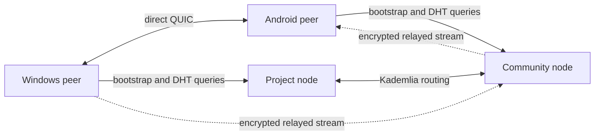

# CharP2P technical design

## Scope

This document defines protocol boundaries for the MVP. The networking and data
model live in portable Rust crates so Windows and Android implement the same
protocol. ADR-001 records the selected Tauri application shell.

## System topology



The project node has no protocol authority. It initially improves availability
because its addresses ship with the application. Community nodes implement the
same public protocol and can be added to the routing table.

## Node roles

### Light peer

Used by Android and constrained devices. It queries the DHT, advertises its own
groups while active, connects to group peers, and uses relays. It does not have
to answer routing queries for unrelated peers.

### Routing peer

Used by opted-in desktop or server installations. It maintains a Kademlia
routing table, answers DHT queries, and stores bounded, expiring provider
records.

### Relay peer

Accepts bounded circuit-relay reservations. It forwards encrypted streams and
does not terminate the group protocol or possess group keys.

The project-operated deployment runs routing, bootstrap, and relay roles. It
does not store chat events.

## Identity

Each installation creates an Ed25519 device key pair using the operating
system's secure random source. The peer identifier is derived from the public
key. Private keys are stored using platform-protected storage and can be
exported only through an explicitly encrypted backup flow.

The client stores the encoded key in Windows Credential Manager or, on
Android, an app-private preferences vault encrypted by Android Keystore. Secret
bytes remain in Rust, are zeroized after protected-storage operations, and are
never returned to the webview. ADR-007 records the adapter and record format.

A group has a root public key. Its stable identifier is a versioned hash of
that key:

```text
group_id = multihash("charp2p-group-v1" || group_root_public_key)
```

The initial owner controls the corresponding administration key. Membership
and device authorization are expressed as signed group events. The protocol
must support rotating administration keys even if the MVP UI exposes one
owner.

Peer identity proves continuity of a device key, not a person's civil identity.

## Invitations and links

The preferred shared link is an HTTPS App Link:

```text
https://join.charp2p.example/i#<base64url-invitation>
```

Installed applications claim the verified HTTPS link. The fallback web page
explains installation. A custom scheme may be supported for development:

```text
charp2p://join/<base64url-invitation>
```

The encoded invitation contains:

```text
protocol version
group ID and group root public key
random discovery secret
signed invitation capability
human-readable preview metadata authenticated by the capability
expiration
optional peer and relay hints
```

The invitation secret is placed in the URL fragment for the HTTPS form so a
normal web request does not send it to the web server. The landing page must
not load third-party analytics or resources that could capture it.

Invitation parsing is bounded and fully validated before network use. An
invitation is a bearer credential and must be treated as sensitive.

Clients accept only the raw encoded payload, the exact custom URI form above,
or the exact HTTPS host and path above. The HTTPS form must carry the payload in
the fragment. Query-string credentials and lookalike hosts are rejected. The UI
may display authenticated invitation metadata after validation, but it must not
receive or display the discovery secret.

## Discovery

CharP2P uses a dedicated, open libp2p-compatible network rather than storing
application records in BitTorrent Mainline DHT.

An online group member advertises a provider record for an opaque key:

```text
discovery_key = BLAKE3(
  "charp2p-rendezvous-v1" || group_id || discovery_secret
)
```

The DHT maps that key to signed peer provider records. A record contains only:

```text
protocol version
provider peer ID
dialable or relayed multiaddresses
expiry
signature
```

It contains no group name, membership, messages, or group encryption keys.
The 32-byte result is the opaque Kademlia provider-record key preimage. Records
expire quickly and online peers periodically re-advertise. Exact TTL,
refresh interval, record size, and per-peer quotas will be fixed through load
testing.

Clients enter the network through a versioned list of built-in bootstrap
multiaddresses. Invitations and learned routing tables provide additional
entry points. No internet address scanning occurs.

The client bounds bootstrap configuration to 16 entries, provider searches to
8 seconds, and direct reachability checks to 32 providers and 4 seconds. When
no built-in or development bootstrap address is available, the UI reports that
discovery requires a bootstrap node instead of pretending that the group is
offline.

LAN discovery may use mDNS as an additional path, never as the only discovery
mechanism.

## Connectivity

Preferred connectivity order:

1. Existing authenticated connection.
2. Direct QUIC address.
3. Direct TCP address.
4. NAT traversal coordinated through an authenticated relay connection.
5. Circuit relay for the session when direct establishment fails.

All peer streams use authenticated transport encryption. The relay sees source
and destination peer metadata and traffic characteristics but not group
payloads.

A provider record means a peer recently advertised the invitation rendezvous
key. The UI reports a peer as reachable only after an authenticated QUIC
connection succeeds; stale provider records remain a separate status.

## Group protocol

Group state is an authenticated append-only event graph. A canonical event
envelope contains:

```text
protocol_version
group_id
event_id = hash(canonical event body)
author_device_id
author_sequence
causal_parent_ids
created_at (advisory)
event_type
protected_payload
signature
```

Wall-clock time is display metadata and cannot determine authorization or
conflict resolution. Authorization derives from the signed membership state
referenced by the event.

MVP event types are:

```text
GroupCreated
GroupMetadataChanged
InvitationCreated
InvitationRevoked
MemberAdded
MemberRemoved
DeviceAdded
DeviceRevoked
MessageCreated
MessageEdited
MessageDeleted
KeyEpochAdvanced
```

Deletion is a signed tombstone request. It hides content in conforming clients
but cannot guarantee erasure from devices that already received it.

## Synchronization

Peers first exchange a compact summary containing each author's highest
gap-free sequence and the current membership state. They then request missing
event identifiers in batches of at most 256, verify each envelope, and commit
valid events transactionally to local storage.

Synchronization uses three bounded request-response exchanges: author summary,
ordered event identifiers after a sequence, and signed envelopes by identifier.
Summaries contain at most 1,024 authors. Signed-event responses contain at most
256 events, no event above 128 KiB, and no more than 2 MiB of event data.

Requirements:

- Receiving the same event repeatedly is harmless.
- Events may arrive out of order and wait for missing parents.
- An author sequence cannot be reused with different content.
- Events from unauthorized or revoked devices are rejected according to the
  membership state in which they were authored.
- Resource limits apply before signature verification where possible.
- A peer never trusts another peer's statement that an event is valid.

SQLite is the expected local event index, with protected payloads and key
material separated so keys can use platform secure storage.

## Message protection

Transport encryption is mandatory but insufficient because relay and storage
topologies may change. Message payloads therefore require end-to-end
protection.

The implementation must use a reviewed group-messaging construction and
maintained cryptographic libraries. It must not invent encryption, key
derivation, or group key rotation. The selection between an MLS-based design
and a smaller-group sender-key construction is an explicit architecture
decision required before protocol code begins.

Whichever construction is selected must provide:

- Authentication of the sending device.
- Confidentiality from DHT and relay operators.
- Key advancement after member or device removal.
- Replay detection.
- Domain-separated key derivation.
- Versioned algorithm negotiation without silent downgrade.

Cryptography does not provide anonymity: peers and relays can observe network
metadata, and group members know which device signed a message.

## Local data

Each client stores:

- Device identity and authorized group key material.
- Verified group events.
- Peer addresses with last-success metadata.
- Pending invitations and synchronization state.
- User preferences and local blocks.

Pending invitation metadata is indexed in SQLite. The signed bearer credential
is stored separately in platform-protected storage and is revalidated against
the indexed metadata whenever the pending join is loaded.

Secrets must be excluded from diagnostics, notifications, URLs sent to web
servers, and routine logs.

## Project-operated node policy

The project node stores only bounded DHT records, relay reservations, routing
state, and minimal security telemetry. It does not store group events or
message payloads.

The initial standalone node implements bootstrap and Kademlia routing with
in-memory DHT state. It rejects group synchronization requests. Relay service,
traffic quotas, metrics, and deployment packaging remain production gates.

It can:

- Enforce per-IP and per-peer connection and bandwidth limits.
- Reject malformed, unsigned, oversized, or expired records.
- End relay reservations and reject peer identities locally.
- Respond within its technical capability to valid orders concerning the node.

It cannot remove a group or message from independent devices or nodes. The
production deployment must publish its operator, privacy, retention, abuse,
and security-contact information before public access.

## Threats covered in the MVP

- Forged messages and group events.
- Invitation tampering and expired invitations.
- Replay and duplicate events.
- Unauthorized membership changes.
- DHT record flooding and oversized inputs.
- Relay exhaustion.
- Malicious synchronization peers sending invalid graphs.
- Secret leakage through logging and link handling.
- Compromised member-device revocation for future access.

The MVP does not claim to prevent an authorized member from copying plaintext,
screenshots, or previously received history.

## Implementation gates

Before protocol implementation:

1. Select and prototype the group-message protection construction.
2. Select the portable core and UI stack.
3. Define canonical binary serialization and size limits.
4. Write protocol test vectors for identities, invitations, event signatures,
   and discovery keys.
5. Threat-model joins, removal, conflicting membership events, and lost owner
   keys.
6. Decide supported Windows and Android versions.

Before public node deployment:

1. Load-test DHT and relay quotas.
2. Document logging and retention.
3. Publish node terms, privacy information, and security contact.
4. Run an independent protocol and cryptography review.
5. Provide at least two independently deployable bootstrap configurations.

## Reference protocols

- [libp2p specifications](https://github.com/libp2p/specs)
- [libp2p Kademlia DHT](https://github.com/libp2p/specs/tree/master/kad-dht)
- [libp2p Circuit Relay v2](https://github.com/libp2p/specs/blob/master/relay/circuit-v2.md)
- [Messaging Layer Security, RFC 9420](https://www.rfc-editor.org/rfc/rfc9420)
